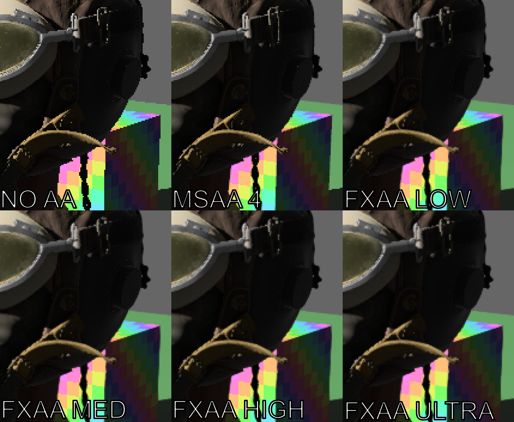

# bevy_mod_fxaa

## FXAA post processing for Bevy



Usage:
```rust
// Add FXAA plugin
app.add_plugin(FXAAPlugin) 
```

```rust
// Add FXAA component to camera:
commands
    .spawn(Camera3dBundle::default())
    .insert(FXAA::default());
```

Currently depends on bevy 0.9.0-dev.
