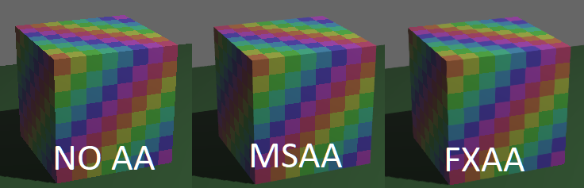

# bevy_mox_fxaa

## FXAA post processing for Bevy



Usage:
```rust
// Disable msaa:
fn main() {
    App::new()
        .insert_resource(Msaa { samples: 1 })
        .add_plugins(DefaultPlugins)
        .add_plugin(FXAAPlugin) // Add FXAA plugin
// [...]

// Add FXAA component to camera:
commands
    .spawn(Camera3dBundle {
        ..default()
    })
    .insert(FXAA { enabled: true });
```

Currently depends on `tonemapping-upscaling-passes` branch. To be hopefully merged for Bevy 0.9
https://github.com/bevyengine/bevy/pull/3425

`bevy = { git = "https://github.com/jakobhellermann/bevy", branch = "tonemapping-upscaling-passes" }`
